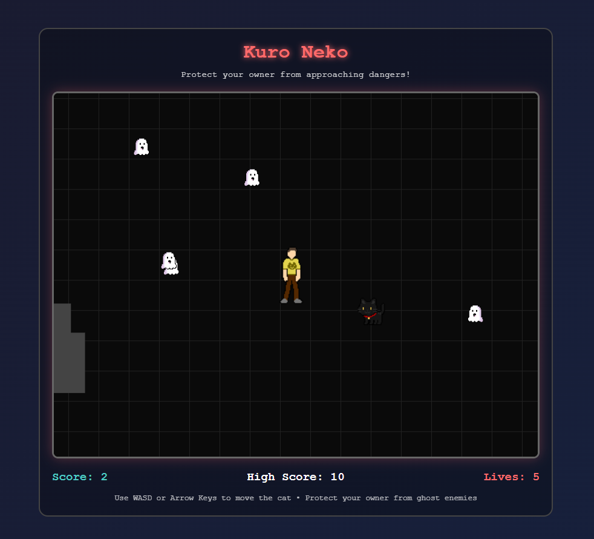

# Kuro Neko 🐈 - Ghost Guardian Game

A fun browser-based game where you play as a protective cat defending your owner from approaching ghosts.

## 🎮 Game Description

In Kuro Neko (Black Cat), you take on the role of a guardian cat protecting your owner from mysterious ghost entities. Navigate through a dark world, intercepting ghosts before they can reach your owner.

### Features

- **Unique Characters**:
  - 🐈 Playable Cat Guardian (controllable)
  - 👻 Regular Ghost Enemies
  - 🔴 Special Red Ghosts (faster, appears every 7 seconds)
  - 👤 Owner Character (AI-controlled)

- **Game Mechanics**:
  - Smooth movement controls (WASD or Arrow Keys)
  - Dynamic camera following the owner
  - Score tracking system with local high score storage
  - Lives system
  - Collision detection
  - Random ghost spawning from all directions

### Controls

- **Movement**:
  - `W` or `↑` : Move Up
  - `S` or `↓` : Move Down
  - `A` or `←` : Move Left
  - `D` or `→` : Move Right

## 🎯 Gameplay Objectives

- Protect your owner from approaching ghosts
- Intercept ghosts before they reach the owner
- Watch out for special red ghosts that move faster
- Try to achieve the highest score possible
- Maintain your lives by preventing ghost-owner collisions

## 🔧 Technical Details

### Built With

- HTML5 Canvas for rendering
- Pure JavaScript for game logic
- CSS for styling
- LocalStorage for high score persistence

### Technical Features

- Sprite-based animations
- Dynamic character facing directions
- Collision detection system
- Camera tracking system
- Grid-based background
- Responsive game container
- Obstacle system for varied gameplay

## 🚀 Getting Started

1. Clone the repository
2. Open `index.html` in a modern web browser
3. Click "Start Game" to begin playing

## 🎨 Asset Credits

- Cat Sprite
- Ghost Sprite
- Player Sprite

## 🎮 Game Features

- Start Screen
- Game Over Screen
- High Score System
- Life Counter
- Score Display
- Dynamic Difficulty (with red ghosts)

## 🔄 Updates & Features

- [x] Basic game mechanics
- [x] Sprite implementations
- [x] High score system
- [x] Special red ghost enemies
- [x] Start screen
- [x] Game over screen
- [x] Sprite direction handling

---

Created with by Chewear
